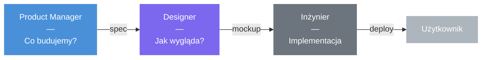
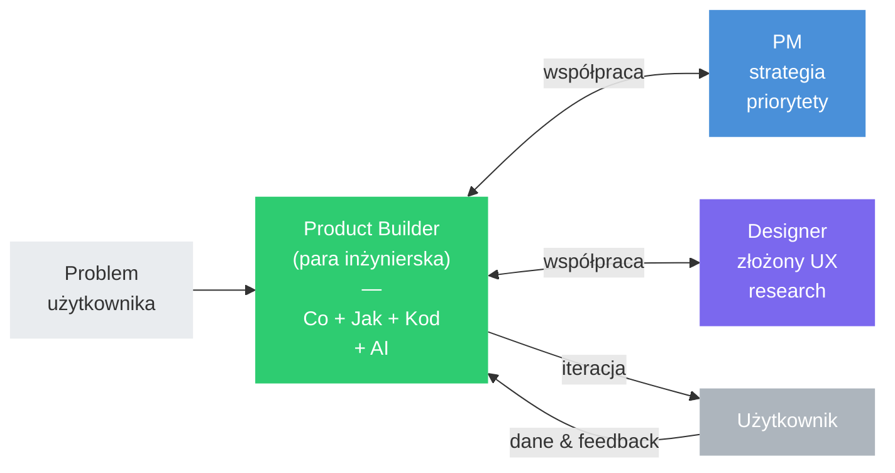

Przez lata model pracy w zespołach produktowych wyglądał mniej więcej tak: Product Manager decyduje *co* budujemy, Designer projektuje *jak* to wygląda, a inżynier *implementuje*. Każdy w swoim silosie, każdy w swoim ogródku. Brzmi porządnie. Problem w tym, że ten model coraz gorzej działa.

### Tradycyjny model

### Product Builder model

## Co się zmieniło?

Dwie rzeczy jednocześnie.

Po pierwsze — AI przestał być ciekawostką. Narzędzia typu Copilot, Cursor, Claude to nie jest już „fajny gadżet do autokompletowania". To realne dźwignie, które pozwalają jednemu inżynierowi zrobić w dzień to, co kiedyś zajmowało tydzień. Ale tylko wtedy, gdy ten inżynier wie *co* chce zbudować i *dlaczego*. AI przyspiesza budowanie — nie zastępuje myślenia.

Po drugie — tradycyjny podział odpowiedzialności generuje wąskie gardła. Designer jest zajęty? Czekamy. PM nie opisał ticketa? Czekamy. Nikt nie wie, czy feature działa, bo nikt nie zadbał o metryki? Cóż, trudno.

To nie jest problem ludzi. To problem systemu.

## Czym jest Product Builder?

Product Builder to nie nowy tytuł. To zmiana w sposobie myślenia o roli inżyniera.

W tradycyjnym modelu inżynier dostaje zadanie i je realizuje. W modelu Product Buildera — inżynier jest współtwórcą rozwiązania. Rozumie problem użytkownika. Kwestionuje słabe założenia. Proponuje alternatywy — w tym prostsze. Podejmuje decyzje UX tam, gdzie nie jest potrzebny głęboki research. I bierze odpowiedzialność za efekt, nie tylko za kod.

Kluczowa zmiana: **business awareness przestaje być „nice to have" i staje się oczekiwaniem bazowym.** Inżynier, który nie rozumie, dlaczego coś buduje i jaki ma to wpływ na metryki, nie realizuje tej roli w pełni.

## Co to oznacza w praktyce?

Kilka konkretnych przesunięć:

**Od implementacji do ownership.** Zamiast „zrobiłem ticket" — „rozwiązałem problem użytkownika i mam dane, które to potwierdzają". Odpowiedzialność ciągnie się od pomysłu, przez delivery, po mierzalny wynik.

**Od czekania na design do samodzielnych decyzji.** Nie każdy ekran wymaga pełnego procesu discovery. Wiele decyzji UX może podjąć inżynier, który dba o spójność i klarowność — bez blokowania się na dostępność designera.

**Od AI jako ciekawostki do AI jako narzędzia pierwszej klasy.** Bardzo szybkie prototypowanie, iteracja nad UI i logiką, przyspieszenie discovery. To nasz sposób pracy.

**Od zadań do problemów.** Product Builder nie myśli w kategoriach backlogu. Myśli: jaki problem rozwiązuję, dla kogo, i skąd będę wiedział, że się udało.

## Czym to NIE jest?

Warto powiedzieć wprost, czym ten model nie jest, bo łatwo o nieporozumienia.

- **Nie zastępuje Product Managera.** Strategia, priorytety, roadmapa — to nadal domena PM-a.
- **Nie zastępuje Designera.** Złożony research, projektowanie systemowe, głęboka analiza UX — to nadal wymaga specjalistów.
- **Nie oznacza pracy w izolacji.** Wręcz przeciwnie — wymaga bliższej współpracy, bo granice odpowiedzialności się zacierają i trzeba je świadomie negocjować.

To jest rozszerzenie ownership, nie robienie wszystkiego samemu.

## Małe zespoły, duża odpowiedzialność

Naturalną konsekwencją tego modelu są małe, 2-osobowe zespoły (pary inżynierskie) z jasno zdefiniowanym scope'em. Każda para jest odpowiedzialna za konkretny kawałek produktu — end-to-end.

To nie jest nowość w świecie software'u. Amazon ma two-pizza teams, Spotify miał squady. Ale różnica polega na tym, że tutaj para inżynierów nie jest „zespołem implementacyjnym" — jest zespołem produktowym. Z pełną odpowiedzialnością za outcome.

## Kiedy ten model NIE działa?

I to jest może najważniejsza rzecz do powiedzenia: **nie każdy problem to problem Product Buildera.**

Inicjatywy głęboko architektoniczne, infrastrukturalne, wysokiego ryzyka — wymagają przemyślanego, inżynieryjnego podejścia, a nie szybkiej iteracji z AI. Jak to trafnie ujmuje jedno zdanie, które powiedział jeden z liderów w edrone:

> **Coding is cheap. Software isn't.**

AI przyspiesza pisanie kodu. Nie przyspiesza myślenia o systemach, zarządzania złożonością ani podejmowania decyzji architektonicznych. Wiedzieć, kiedy *nie* stosować tego modelu, jest równie ważne jak wiedzieć, kiedy go stosować.

## Dlaczego to ma znaczenie?

Bo model, w którym inżynieria = implementacja, design = wąskie gardło, a AI = ciekawostka, przestaje być konkurencyjny.

Świat się zmienił. Narzędzia się zmieniły. Oczekiwania się zmieniły. Jedyne, co się nie zmieniło, to potrzeba ludzi, którzy rozumieją problemy i biorą odpowiedzialność za ich rozwiązanie.

Product Builder to nie rewolucja. To uznanie, że granica między „budowaniem produktu" a „pisaniem kodu" zawsze była sztuczna — i że najwyższy czas ją przenieść.
